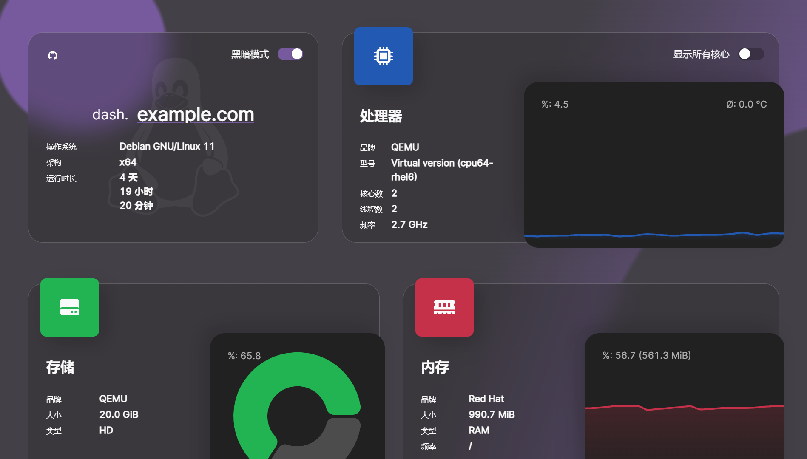

<!-- markdownlint-disable -->
<h1>
  
</h1>

<p align="center">
  <a href="https://drone.mauz.io/MauriceNino/dashdot" target="_blank">
    
  </a>

  <a href="https://discord.gg/3teHFBNQ9W" target="_blank">
    
  </a>
</p>
<p align="center">
  <i>Feel free to join the <b>Discord</b> and <b>star the repo</b> if you like the project!</i>
</p>

<br/>

<p align="center">
  <b>dash.</b> (or <b>dashdot</b>) is a modern server dashboard,
  running on the latest tech, designed with glassmorphism in mind.
  It is intended to be used for smaller VPS and private servers.
</p>
<br />
<p align="center">
  <a href="https://dash.mauz.io" target="_blank">Live Demo</a>
 |
  <a href="https://hub.docker.com/r/mauricenino/dashdot" target="_blank">Docker Image</a>
</p>

#

<a href="https://ko-fi.com/mauricenino" target="_blank">
  
</a>

<!-- markdownlint-enable -->

**dash.** is a open-source project, so any contribution is highly appreciated.
If you are interested in further developing this project, have a look at the
[Contributing.md](./.github/CONTRIBUTING.md).

In case you want to financially support this project, you can visit my
[GitHub Sponsors](https://github.com/sponsors/MauriceNino), or my [Ko-Fi](https://ko-fi.com/mauricenino).

## Preview

<!-- markdownlint-disable -->

| Dark-Mode                                                                                    | Light-Mode                                                                                     |
| -------------------------------------------------------------------------------------------- | ---------------------------------------------------------------------------------------------- |
|  |  |

<!-- markdownlint-enable -->

## Documentation

- [Installation Options](https://getdashdot.com/docs/install)
- [Configuration Options](https://getdashdot.com/docs/config)
- [Contributing](./.github/CONTRIBUTING.md)
- [Changelog](./.github/CHANGELOG.md)

## Quick Install (Docker)

Images are hosted on [DockerHub](https://hub.docker.com/r/mauricenino/dashdot),
and are available for both AMD64 and ARM devices.

```bash
docker container run -it \
  -p 80:3001 \
  -v /:/mnt/host:ro \
  --privileged \
  mauricenino/dashdot
```

To get more information on why which flag is needed, or if you want to use other
install options instead (`docker-compose`, or from source), have a look at the
[installation options](https://getdashdot.com/docs/install).

To read more about configuration options, you can visit the [configuration options](https://getdashdot.com/docs/config).
